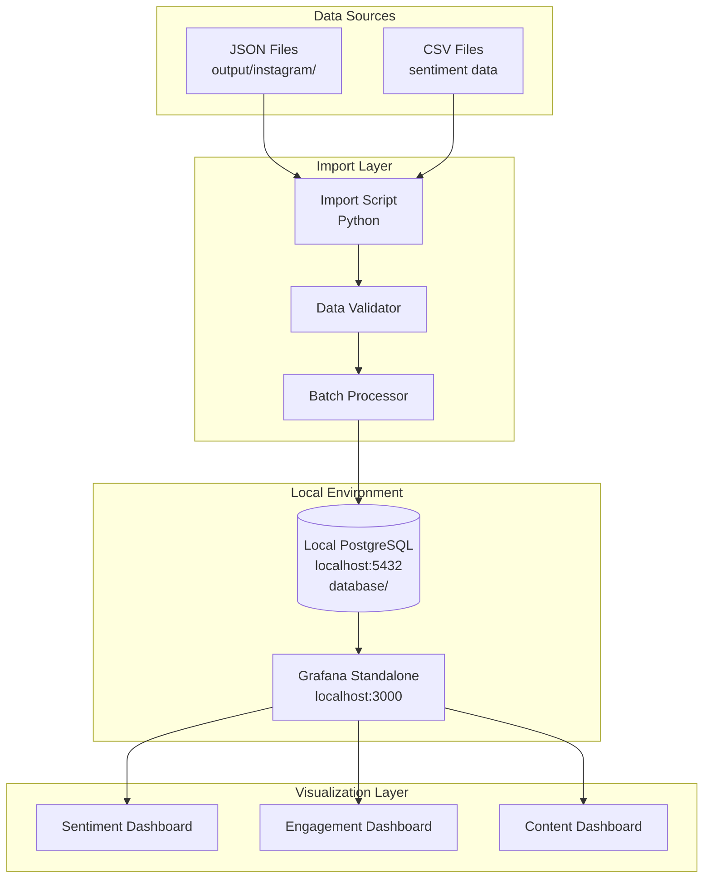

# Design Document: Grafana-PostgreSQL Integration

## Overview

This design document describes the architecture and implementation approach for integrating Grafana with PostgreSQL to visualize Instagram scraping results. The system consists of three main components:

1. **Data Import Script** - Python script that imports JSON/CSV files into PostgreSQL
2. **Manual Environment Setup** - Local PostgreSQL database and standalone Grafana installation
3. **Grafana Dashboards** - Pre-configured visualization dashboards

The design leverages the existing database schema and operations module, extending them with import capabilities and visualization layers. The system uses manual setup on Windows with the existing local PostgreSQL instance (in the database/ directory) and a standalone Grafana installation, emphasizing ease of setup (< 15 minutes) and minimal configuration.

## Architecture

### High-Level Architecture



### Component Interaction Flow

1. **Import Flow**:
   - User executes import script with file/directory path
   - Script reads and validates JSON/CSV data
   - Batch processor groups records for efficient insertion
   - Data is upserted into local PostgreSQL using existing db_operations module
   - Progress and errors are logged to console and file

2. **Visualization Flow**:
   - Grafana connects to local PostgreSQL via provisioned data source
   - Dashboards execute SQL queries against posts and sentiments tables
   - Results are rendered as charts, tables, and gauges
   - Auto-refresh keeps visualizations current

3. **Manual Setup Flow**:
   - User downloads Grafana Windows executable from official website
   - User extracts Grafana to local directory
   - User copies provisioning files to Grafana's provisioning directory
   - User starts Grafana executable
   - Grafana automatically loads data source and dashboards from provisioning files

## Components and Interfaces

### 1. Data Import Script (`import_data.py`)

**Purpose**: Import scraped Instagram data from JSON/CSV files into PostgreSQL database.

**Key Classes**:

```python
class DataImporter:
    """Main importer class handling file processing and database operations"""
    
    def __init__(self, db_connection, batch_size=50, incremental=False):
        """
        Initialize importer with database connection
        
        Args:
            db_connection: DatabaseConnection instance
            batch_size: Number of records per batch insert
            incremental: Skip existing records if True
        """
        
    def import_file(self, file_path: str) -> ImportResult:
        """Import single JSON or CSV file"""
        
    def import_directory(self, dir_path: str) -> ImportResult:
        """Import all JSON/CSV files in directory"""
        
    def _process_json(self, data: dict) -> List[PostRecord]:
        """Parse JSON structure and extract post records"""
        
    def _process_csv(self, df: pd.DataFrame) -> List[PostRecord]:
        """Parse CSV and extract post records"""
        
    def _batch_insert_posts(self, posts: List[PostRecord]):
        """Insert posts in batches with upsert logic"""
        
    def _insert_sentiments(self, post_db_id: int, sentiment_data: dict):
        """Insert sentiment data linked to post"""
```

**Key Functions**:

```python
def validate_post_record(record: dict) -> Tuple[bool, Optional[str]]:
    """
    Validate post record has required fields and correct types
    
    Returns:
        (is_valid, error_message)
    """
    
def validate_sentiment_record(record: dict) -> Tuple[bool, Optional[str]]:
    """
    Validate sentiment scores are in valid ranges
    
    Returns:
        (is_valid, error_message)
    """
    
def normalize_timestamp(timestamp_str: str) -> datetime:
    """Convert various timestamp formats to datetime"""
    
def normalize_hashtags(hashtags: List[str]) -> List[str]:
    """Remove # prefix and lowercase hashtags"""
```

**Data Structures**:

```python
@dataclass
class PostRecord:
    """Represents a post record for import"""
    post_id: str
    platform: str
    author: str
    content: str
    timestamp: datetime
    likes: int = 0
    comments_count: int = 0
    shares: int = 0
    url: Optional[str] = None
    author_id: Optional[str] = None
    media_type: Optional[str] = None
    hashtags: List[str] = field(default_factory=list)
    sentiment: Optional[dict] = None
    comments: List[dict] = field(default_factory=list)
    raw_data: Optional[dict] = None

@dataclass
class ImportResult:
    """Result of import operation"""
    total_processed: int
    inserted: int
    updated: int
    skipped: int
    failed: int
    errors: List[str]
    duration_seconds: float
```

**Interface with Existing Code**:
- Uses `database.db_connection.get_db_connection()` for database access
- Uses `database.db_operations.insert_post()` for post insertion
- Uses `database.db_operations.insert_sentiment()` for sentiment insertion
- Leverages existing upsert logic in `insert_post()`

### 2. Manual Setup Configuration

**Purpose**: Configure Grafana to connect to local PostgreSQL and load dashboards automatically.

**Grafana Installation**:
- Download Grafana Windows executable from https://grafana.com/grafana/download?platform=windows
- Extract to local directory (e.g., `C:\grafana\`)
- Grafana binary location: `C:\grafana\bin\grafana-server.exe`

**Directory Structure**:
```
project_root/
├── grafana/
│   ├── provisioning/
│   │   ├── datasources/
│   │   │   └── postgres.yml
│   │   └── dashboards/
│   │       └── default.yml
│   └── dashboards/
│       ├── sentiment-overview.json
│       ├── engagement-metrics.json
│       └── content-analysis.json
├── database/
│   └── (existing local PostgreSQL setup)
└── import_data.py
```

**Setup Steps**:
1. Ensure local PostgreSQL is running (existing database/ setup)
2. Download and extract Grafana for Windows
3. Copy `grafana/provisioning/` directory to Grafana installation:
   - Source: `project_root/grafana/provisioning/`
   - Destination: `C:\grafana\conf\provisioning\`
4. Copy dashboard JSON files to Grafana:
   - Source: `project_root/grafana/dashboards/`
   - Destination: `C:\grafana\dashboards\`
5. Start Grafana: Run `C:\grafana\bin\grafana-server.exe`
6. Access Grafana at http://localhost:3000 (default credentials: admin/admin)

**Key Features**:
- Uses existing local PostgreSQL instance
- No Docker dependencies
- Automatic dashboard and data source provisioning
- Grafana runs as standalone Windows process
- Configuration via local files

### 3. Grafana Provisioning

**Purpose**: Automatically configure Grafana data source and dashboards on startup using local file system.

**Data Source Provisioning** (`grafana/provisioning/datasources/postgres.yml`):

```yaml
apiVersion: 1

datasources:
  - name: Instagram PostgreSQL
    type: postgres
    access: proxy
    url: localhost:5432
    database: instagram_analytics
    user: postgres
    secureJsonData:
      password: your_local_postgres_password
    jsonData:
      sslmode: disable
      postgresVersion: 1500
      timescaledb: false
    isDefault: true
    editable: true
```

**Note**: Update the `password` field with your local PostgreSQL password before copying to Grafana's provisioning directory.

**Dashboard Provisioning** (`grafana/provisioning/dashboards/default.yml`):

```yaml
apiVersion: 1

providers:
  - name: 'Instagram Dashboards'
    orgId: 1
    folder: 'Instagram Analytics'
    type: file
    disableDeletion: false
    updateIntervalSeconds: 10
    allowUiUpdates: true
    options:
      path: C:/grafana/dashboards
      foldersFromFilesStructure: true
```

**Note**: Update the `path` field to match your Grafana installation directory where dashboard JSON files are copied.

### 4. Dashboard Definitions

**Purpose**: Pre-configured JSON dashboard definitions for Grafana.

#### Sentiment Overview Dashboard

**Panels**:
1. **Sentiment Distribution Pie Chart**
   - Query: `SELECT label, COUNT(*) FROM sentiments GROUP BY label`
   - Visualization: Pie chart
   - Shows positive/neutral/negative distribution

2. **Sentiment Trend Line Chart**
   - Query: 
     ```sql
     SELECT 
       DATE_TRUNC('day', p.timestamp) as time,
       AVG(s.compound) as avg_sentiment
     FROM posts p
     JOIN sentiments s ON p.id = s.post_id
     WHERE p.timestamp >= $__timeFrom() AND p.timestamp <= $__timeTo()
     GROUP BY DATE_TRUNC('day', p.timestamp)
     ORDER BY time
     ```
   - Visualization: Time series line chart
   - Shows sentiment trends over time

3. **Average Sentiment Gauge**
   - Query: `SELECT AVG(compound) FROM sentiments`
   - Visualization: Gauge (-1 to 1 range)
   - Shows overall sentiment health

4. **Sentiment by Post Type**
   - Query:
     ```sql
     SELECT 
       p.media_type,
       s.label,
       COUNT(*) as count
     FROM posts p
     JOIN sentiments s ON p.id = s.post_id
     GROUP BY p.media_type, s.label
     ```
   - Visualization: Stacked bar chart
   - Compares sentiment across post types

#### Engagement Metrics Dashboard

**Panels**:
1. **Total Posts/Reels Stats**
   - Query: 
     ```sql
     SELECT 
       COUNT(*) FILTER (WHERE media_type = 'post') as posts,
       COUNT(*) FILTER (WHERE media_type = 'reel') as reels
     FROM posts
     ```
   - Visualization: Stat panels
   - Shows total counts

2. **Top Posts Table**
   - Query:
     ```sql
     SELECT 
       author,
       content,
       likes,
       comments_count,
       shares,
       (likes + comments_count + shares) as total_engagement,
       timestamp
     FROM posts
     WHERE timestamp >= $__timeFrom() AND timestamp <= $__timeTo()
     ORDER BY total_engagement DESC
     LIMIT 10
     ```
   - Visualization: Table
   - Shows top performing posts

3. **Engagement Rate Over Time**
   - Query:
     ```sql
     SELECT 
       DATE_TRUNC('day', timestamp) as time,
       AVG(likes + comments_count + shares) as avg_engagement
     FROM posts
     WHERE timestamp >= $__timeFrom() AND timestamp <= $__timeTo()
     GROUP BY DATE_TRUNC('day', timestamp)
     ORDER BY time
     ```
   - Visualization: Time series line chart
   - Shows engagement trends

4. **Post Type Distribution**
   - Query: `SELECT media_type, COUNT(*) FROM posts GROUP BY media_type`
   - Visualization: Pie chart
   - Shows posts vs reels ratio

#### Content Analysis Dashboard

**Panels**:
1. **Top Hashtags Bar Chart**
   - Query:
     ```sql
     SELECT 
       UNNEST(hashtags) as hashtag,
       COUNT(*) as frequency
     FROM posts
     WHERE timestamp >= $__timeFrom() AND timestamp <= $__timeTo()
     GROUP BY hashtag
     HAVING COUNT(*) >= 3
     ORDER BY frequency DESC
     LIMIT 20
     ```
   - Visualization: Horizontal bar chart
   - Shows most used hashtags

2. **Posting Frequency Heatmap**
   - Query:
     ```sql
     SELECT 
       EXTRACT(DOW FROM timestamp) as day_of_week,
       EXTRACT(HOUR FROM timestamp) as hour,
       COUNT(*) as post_count
     FROM posts
     WHERE timestamp >= $__timeFrom() AND timestamp <= $__timeTo()
     GROUP BY day_of_week, hour
     ```
   - Visualization: Heatmap
   - Shows posting patterns by day/hour

3. **Average Comments Per Post**
   - Query: `SELECT AVG(comments_count) FROM posts`
   - Visualization: Stat panel
   - Shows engagement metric

4. **Content Length Distribution**
   - Query:
     ```sql
     SELECT 
       CASE 
         WHEN LENGTH(content) < 50 THEN '0-50'
         WHEN LENGTH(content) < 100 THEN '50-100'
         WHEN LENGTH(content) < 200 THEN '100-200'
         WHEN LENGTH(content) < 500 THEN '200-500'
         ELSE '500+'
       END as length_range,
       COUNT(*) as count
     FROM posts
     GROUP BY length_range
     ORDER BY length_range
     ```
   - Visualization: Bar chart
   - Shows content length patterns

### 5. SQL Query Library

**Purpose**: Reusable SQL queries for common analytics operations.

**File**: `sql_queries/analytics_queries.sql`

```sql
-- Sentiment Distribution
-- Returns count of posts by sentiment label
SELECT 
    label,
    COUNT(*) as count,
    ROUND(COUNT(*) * 100.0 / SUM(COUNT(*)) OVER (), 2) as percentage
FROM sentiments s
JOIN posts p ON s.post_id = p.id
WHERE p.timestamp >= :start_date AND p.timestamp <= :end_date
GROUP BY label
ORDER BY count DESC;

-- Top Posts by Engagement
-- Returns top N posts ranked by total engagement
SELECT 
    p.post_id,
    p.author,
    p.content,
    p.likes,
    p.comments_count,
    p.shares,
    (p.likes + p.comments_count + p.shares) as total_engagement,
    p.timestamp,
    s.label as sentiment
FROM posts p
LEFT JOIN sentiments s ON p.id = s.post_id
WHERE p.timestamp >= :start_date AND p.timestamp <= :end_date
ORDER BY total_engagement DESC
LIMIT :limit;

-- Daily Post Counts
-- Returns number of posts per day
SELECT 
    DATE(timestamp) as date,
    COUNT(*) as post_count,
    COUNT(*) FILTER (WHERE media_type = 'post') as posts,
    COUNT(*) FILTER (WHERE media_type = 'reel') as reels
FROM posts
WHERE timestamp >= :start_date AND timestamp <= :end_date
GROUP BY DATE(timestamp)
ORDER BY date;

-- Sentiment Trends Over Time
-- Returns average sentiment scores by day
SELECT 
    DATE(p.timestamp) as date,
    AVG(s.compound) as avg_compound,
    AVG(s.positive) as avg_positive,
    AVG(s.neutral) as avg_neutral,
    AVG(s.negative) as avg_negative,
    COUNT(*) as post_count
FROM posts p
JOIN sentiments s ON p.id = s.post_id
WHERE p.timestamp >= :start_date AND p.timestamp <= :end_date
GROUP BY DATE(p.timestamp)
ORDER BY date;

-- Hashtag Frequency Analysis
-- Returns most used hashtags with counts
SELECT 
    UNNEST(hashtags) as hashtag,
    COUNT(*) as frequency,
    AVG(likes) as avg_likes,
    AVG(comments_count) as avg_comments
FROM posts
WHERE timestamp >= :start_date AND timestamp <= :end_date
GROUP BY hashtag
HAVING COUNT(*) >= :min_frequency
ORDER BY frequency DESC
LIMIT :limit;

-- Engagement Rate by Author
-- Returns engagement metrics per author
SELECT 
    author,
    COUNT(*) as total_posts,
    SUM(likes) as total_likes,
    SUM(comments_count) as total_comments,
    SUM(shares) as total_shares,
    ROUND(AVG(likes + comments_count + shares), 2) as avg_engagement,
    ROUND(SUM(likes + comments_count + shares) * 1.0 / COUNT(*), 2) as engagement_rate
FROM posts
WHERE timestamp >= :start_date AND timestamp <= :end_date
GROUP BY author
ORDER BY engagement_rate DESC;

-- Posting Time Analysis
-- Returns posting patterns by hour and day of week
SELECT 
    EXTRACT(DOW FROM timestamp) as day_of_week,
    EXTRACT(HOUR FROM timestamp) as hour,
    COUNT(*) as post_count,
    AVG(likes + comments_count + shares) as avg_engagement
FROM posts
WHERE timestamp >= :start_date AND timestamp <= :end_date
GROUP BY day_of_week, hour
ORDER BY day_of_week, hour;

-- Content Performance by Length
-- Analyzes engagement based on content length
SELECT 
    CASE 
        WHEN LENGTH(content) < 50 THEN 'Very Short (0-50)'
        WHEN LENGTH(content) < 100 THEN 'Short (50-100)'
        WHEN LENGTH(content) < 200 THEN 'Medium (100-200)'
        WHEN LENGTH(content) < 500 THEN 'Long (200-500)'
        ELSE 'Very Long (500+)'
    END as length_category,
    COUNT(*) as post_count,
    ROUND(AVG(likes), 2) as avg_likes,
    ROUND(AVG(comments_count), 2) as avg_comments,
    ROUND(AVG(likes + comments_count + shares), 2) as avg_engagement
FROM posts
WHERE timestamp >= :start_date AND timestamp <= :end_date
GROUP BY length_category
ORDER BY 
    CASE length_category
        WHEN 'Very Short (0-50)' THEN 1
        WHEN 'Short (50-100)' THEN 2
        WHEN 'Medium (100-200)' THEN 3
        WHEN 'Long (200-500)' THEN 4
        ELSE 5
    END;
```

## Data Models

The system uses the existing database schema defined in `database/migrations/001_initial_schema.sql`. No schema changes are required.

### Existing Tables Used

**posts table**:
- Stores Instagram post/reel data
- Primary key: `id` (serial)
- Unique constraint: `post_id` (Instagram post ID)
- Indexed fields: `platform`, `timestamp`, `author`, `scraped_at`
- Array field: `hashtags` (text[])
- JSONB field: `raw_data` (stores original JSON)

**sentiments table**:
- Stores sentiment analysis results
- Primary key: `id` (serial)
- Foreign key: `post_id` references `posts(id)` with CASCADE delete
- Indexed fields: `post_id`, `label`, `processed_at`
- Score fields: `score`, `compound`, `positive`, `neutral`, `negative`

**execution_logs table**:
- Stores import execution logs
- Primary key: `id` (serial)
- Indexed fields: `workflow_id`, `status`, `executed_at`
- JSONB field: `metadata` (stores import statistics)

### Data Mapping

**JSON to Database Mapping**:

```python
# JSON structure from scraper output
{
    "post_id": "ABC123",
    "post_type": "reel",
    "author": "username",
    "content": "Post caption...",
    "timestamp": "2026-02-09T14:52:19.279509Z",
    "likes": 384,
    "comments_count": 3,
    "hashtags": ["#tag1", "#tag2"],
    "sentiment": {
        "score": 0.5,
        "label": "positive",
        "compound": 0.5,
        "positive": 0.7,
        "neutral": 0.2,
        "negative": 0.1,
        "model": "vader"
    }
}

# Maps to posts table
INSERT INTO posts (
    post_id,           # "ABC123"
    platform,          # "instagram" (hardcoded)
    author,            # "username"
    content,           # "Post caption..."
    timestamp,         # parsed datetime
    likes,             # 384
    comments_count,    # 3
    media_type,        # "reel"
    hashtags,          # ["tag1", "tag2"] (normalized)
    raw_data           # entire JSON as JSONB
)

# Maps to sentiments table (after post insert)
INSERT INTO sentiments (
    post_id,           # posts.id (from previous insert)
    score,             # 0.5
    label,             # "positive"
    compound,          # 0.5
    positive,          # 0.7
    neutral,           # 0.2
    negative,          # 0.1
    model              # "vader"
)
```

**CSV to Database Mapping**:

CSV files follow a flattened structure with columns matching database fields:
- `post_id`, `author`, `content`, `timestamp`, `likes`, `comments_count`, `shares`
- `sentiment_score`, `sentiment_label`, `sentiment_compound`, etc.

The import script will parse CSV headers and map columns to appropriate database fields.

## Error Handling

### Import Script Error Handling

**Connection Errors**:
- Retry database connection up to 3 times with exponential backoff (1s, 2s, 4s)
- Log connection failures with full error details
- Exit gracefully if all retries fail

**Data Validation Errors**:
- Validate each record before processing
- Log validation errors with record details
- Skip invalid records and continue processing
- Include validation error count in final summary

**Database Errors**:
- Catch and log foreign key constraint violations
- Catch and log unique constraint violations (duplicate post_id)
- Rollback failed transactions
- Continue processing remaining records

**File Processing Errors**:
- Catch JSON parsing errors with line numbers
- Catch CSV parsing errors with row numbers
- Log file path and error details
- Skip problematic files in batch imports

**Logging Strategy**:
```python
# Console logging: INFO level
# File logging: DEBUG level with full stack traces
# Log file location: logs/import_YYYYMMDD_HHMMSS.log

logger.info(f"Processing file: {file_path}")
logger.debug(f"Record data: {record}")
logger.warning(f"Skipping invalid record: {error}")
logger.error(f"Database error: {error}", exc_info=True)
```

### Grafana Error Handling

**Data Source Connection Errors**:
- Display clear error message in Grafana UI
- Check local PostgreSQL service is running
- Verify network connectivity to localhost:5432
- Validate credentials in provisioning config file

**Query Errors**:
- Display SQL error in panel
- Validate query syntax before saving
- Use query inspector to debug issues
- Check table/column names match schema

**Dashboard Loading Errors**:
- Verify dashboard JSON syntax
- Check provisioning path configuration in default.yml
- Validate data source references
- Review Grafana logs in Grafana installation directory

### Manual Setup Error Handling

**Grafana Startup Failures**:
- Verify Grafana executable has proper permissions
- Check port 3000 is not already in use
- Verify provisioning directory paths are correct
- Review Grafana logs: `C:\grafana\data\log\grafana.log`

**Provisioning Failures**:
- Verify provisioning files are in correct directory structure
- Check YAML syntax in provisioning files
- Ensure dashboard JSON files are valid
- Verify PostgreSQL connection details are correct

**PostgreSQL Connection Issues**:
- Ensure local PostgreSQL service is running
- Verify database `instagram_analytics` exists
- Check PostgreSQL is listening on localhost:5432
- Validate credentials match local PostgreSQL setup

## Testing Strategy

The testing strategy combines unit tests for specific functionality and property-based tests for universal correctness properties.

### Unit Testing Approach

**Import Script Tests**:
- Test JSON parsing with sample files
- Test CSV parsing with sample files
- Test validation functions with valid/invalid data
- Test batch processing with various batch sizes
- Test error handling with malformed data
- Test incremental import logic
- Mock database operations for isolation

**Integration Tests**:
- Test end-to-end import with local test database
- Test Grafana startup and provisioning
- Test Grafana data source connectivity to local PostgreSQL
- Test dashboard query execution
- Test configuration file loading

**Test Data**:
- Create sample JSON files with known data
- Create sample CSV files with edge cases
- Include invalid data for error testing
- Use small datasets for fast test execution

### Property-Based Testing Configuration

Property-based tests will use the **Hypothesis** library for Python, configured to run a minimum of 100 iterations per test. Each test will be tagged with a comment referencing the design property it validates.

**Example Test Structure**:
```python
from hypothesis import given, strategies as st

# Feature: grafana-postgresql-integration, Property 1: <property text>
@given(st.lists(st.text(min_size=1), min_size=1))
def test_property_name(data):
    # Test implementation
    pass
```

### Testing Tools

- **pytest**: Unit test framework
- **Hypothesis**: Property-based testing library
- **pytest-docker**: Docker container testing
- **psycopg2**: Database testing
- **unittest.mock**: Mocking for isolation

### Test Coverage Goals

- Import script: 90% code coverage
- Validation functions: 100% code coverage
- Error handling paths: 80% coverage
- Integration tests: All critical paths covered


## Correctness Properties

*A property is a characteristic or behavior that should hold true across all valid executions of a system—essentially, a formal statement about what the system should do. Properties serve as the bridge between human-readable specifications and machine-verifiable correctness guarantees.*

### Property 1: Data Import Completeness

*For any* valid JSON or CSV file containing post records, when the Import_Script processes the file, all valid records should be inserted into the database and the count of inserted records should equal the count of valid records in the file.

**Validates: Requirements 1.1, 1.7, 1.8**

### Property 2: Upsert Consistency

*For any* post record with a post_id that already exists in the database, when the Import_Script processes that record, the existing database record should be updated with the new data, and querying by post_id should return the updated values.

**Validates: Requirements 1.2, 2.1, 2.2**

### Property 3: Foreign Key Integrity

*For any* post with sentiment data, when the Import_Script inserts the post and sentiment, the sentiment record's post_id foreign key should reference the correct post's database ID, and deleting the post should cascade delete the sentiment.

**Validates: Requirements 1.3**

### Property 4: Import Summary Accuracy

*For any* import operation, when the Import_Script completes, the summary counts (total processed, inserted, updated, skipped, failed) should sum correctly and match the actual operations performed during import.

**Validates: Requirements 1.6, 2.3**

### Property 5: Error Resilience

*For any* batch of records containing some invalid records, when the Import_Script processes the batch, all valid records should be inserted successfully and the import should complete without terminating early.

**Validates: Requirements 1.5, 10.3, 10.6**

### Property 6: Duplicate Detection

*For any* import batch containing duplicate records (same post_id), when the Import_Script processes the batch, only the first occurrence should be inserted and subsequent duplicates should be skipped with warnings logged.

**Validates: Requirements 1.9, 2.4**

### Property 7: Data Validation Completeness

*For any* record with missing required fields, invalid sentiment scores (outside -1 to 1 range), invalid timestamps, or negative engagement metrics, when the Import_Script validates the record, validation should fail and the record should be skipped with an error logged.

**Validates: Requirements 11.1, 11.2, 11.3, 11.4, 11.6**

### Property 8: Hashtag Normalization

*For any* list of hashtags with various formats (with/without # prefix, mixed case), when the Import_Script normalizes the hashtags, all hashtags should have # prefix removed and be converted to lowercase.

**Validates: Requirements 11.5**

### Property 9: Connection Retry Logic

*For any* database connection failure, when the Import_Script attempts to connect, it should retry up to 3 times with exponential backoff delays (1s, 2s, 4s) before failing.

**Validates: Requirements 10.1**

### Property 10: Error Logging Detail

*For any* error encountered during import (JSON parsing, validation, database), when the error occurs, the log file should contain the error message, file name/location, and full stack trace.

**Validates: Requirements 10.2, 10.6**

### Property 11: Grafana Provisioning Validation

*For any* provisioning configuration file (data source or dashboard), when Grafana starts with the file in the provisioning directory, the configuration should be loaded and accessible in Grafana UI.

**Validates: Requirements 3.4, 3.6**

### Property 12: Dashboard Panel Configuration

*For any* panel in any provisioned dashboard, when the dashboard is loaded, the panel should reference the "Instagram PostgreSQL" data source and have a valid SQL query configured.

**Validates: Requirements 4.4**

### Property 13: Date Range Filter Consistency

*For any* date range selected by the user, when the filter is applied, all dashboard queries should return only records with timestamps within the selected range (inclusive).

**Validates: Requirements 5.5, 7.5**

### Property 14: Sentiment Aggregation Logic

*For any* time period longer than 7 days, when the sentiment trend chart displays data, the data should be aggregated by day (DATE_TRUNC) rather than by individual timestamps.

**Validates: Requirements 5.6**

### Property 15: Top Posts Ranking Correctness

*For any* dataset of posts, when the top posts query executes with limit N, the results should be ordered by total engagement (likes + comments + shares) in descending order and contain exactly N records (or fewer if dataset is smaller).

**Validates: Requirements 6.2, 8.2**

### Property 16: Engagement Rate Calculation

*For any* set of posts, when the engagement rate is calculated, it should equal (sum of likes + sum of comments + sum of shares) divided by total number of posts.

**Validates: Requirements 6.6, 8.6**

### Property 17: Hashtag Frequency Filtering

*For any* hashtag frequency query result, when the results are returned, all hashtags should have appeared at least 3 times in the dataset (or the configured minimum frequency).

**Validates: Requirements 7.6**

### Property 18: Top Hashtags Ranking Correctness

*For any* dataset of posts with hashtags, when the top hashtags query executes with limit N, the results should be ordered by frequency in descending order and contain exactly N hashtags (or fewer if unique hashtag count is smaller).

**Validates: Requirements 7.1, 8.5**

### Property 19: Daily Post Count Accuracy

*For any* date range, when the daily post count query executes, the sum of all daily counts should equal the total number of posts in that date range.

**Validates: Requirements 8.3**

### Property 20: Sentiment Trend Calculation

*For any* date range, when the sentiment trend query executes, each day's average sentiment should equal the average of all sentiment compound scores for posts on that day.

**Validates: Requirements 8.4**

### Property 21: SQL Injection Prevention

*For any* user-provided date range parameters (including malicious SQL strings), when queries are executed, the parameters should be properly escaped and no SQL injection should occur.

**Validates: Requirements 8.7**

### Property 22: Average Comments Calculation

*For any* set of posts, when the average comments per post is calculated, it should equal the sum of all comments_count values divided by the total number of posts.

**Validates: Requirements 7.3**
